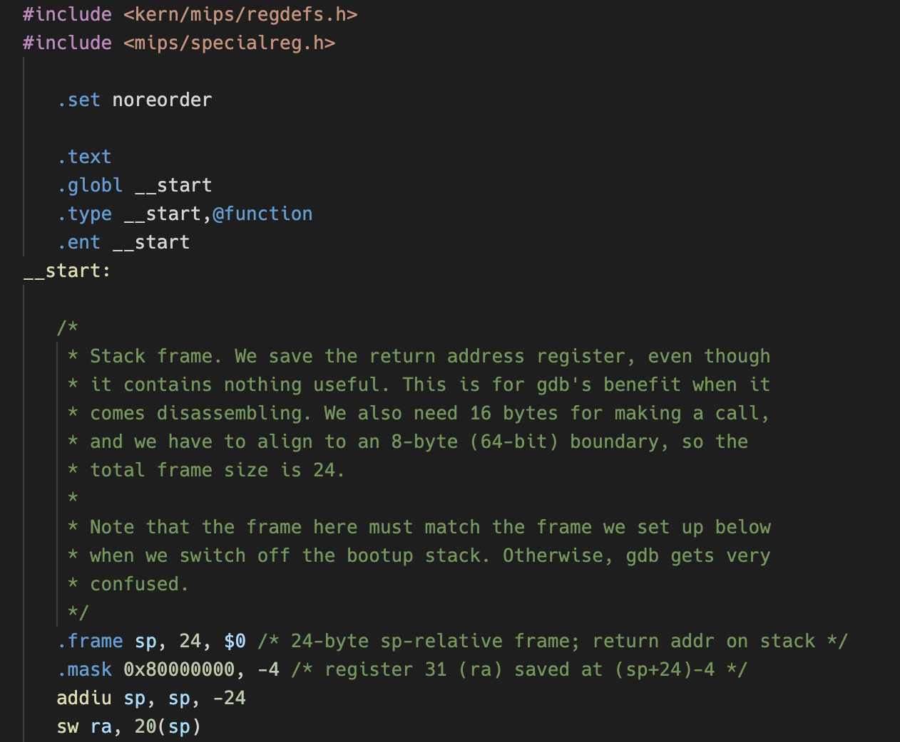

# OS/161 MIPS Syntax Highlighting

Syntax highlighting built to work with the flavour of MIPS assembly code used on System/161, which is part of the [OS/161 project](www.os161.org).

## Features

Features:

- Syntax highlighting (except for floating-point operations/constants)
- No snippets yet
- No preferences yet
- No auto-formatting yet

## Release Notes

### 0.0.1

- Added basic syntax highlighting
